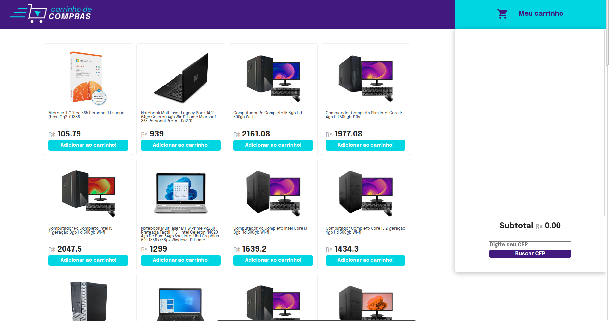

# Shopping Cart
## About the Project

Shopping Cart is a Front-End Application where a fully functional shopping cart was implemented, using the products from the MercadoLibre API.

In this project, I used HTML, JavaScript and CSS technologies.
I used the webpacks: Vite, Jest and Cypress.
In addition to my knowledge of asynchronous functions, API consumption and unit testing.

## Check the Project:

### And it looks like this:

### You can see how it works in:

Watch this video: (https://youtu.be/3eKZecsWBSk)